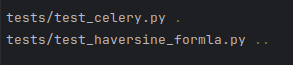

# Geokapti technical test
# presented by JeanPaulSB
# Description
The problem states that a planning company requires to create two microservices
to solve a traveling problem.
# Features
* Dockerized and ready to deploy.
* Implements testing.
* Data validation:
    - Locations: handles corner cases for invalid latitudes and longitudes (outside the -90 deg, 90 deg and -180 deg, 180 deg respectively), not found location by id.
    - Distances: requires at least two **valid** locations for computing the distance.
    - Uses pydantic in schemas for data validation.
* Implements internal communication between microservices.
* Implements logging.
* Uses the haversine formula to compute distances.
* Uses black as a formatter.

## Solution
### Requirements met
- [x] Register a location: name, latitude, longitude and return an ID
- [x] Receive a list of location IDs and return the total distance of the path
- [x] Set up in a github repo
- [x] Build the project with pyproject.toml and poetry
- [x] There should be tests
- [x] Use docker
- [x] Implement some logging with structlog
- [x] The project should be functional out of the box
- [x] Write some documentation explaining the design in a README file.
### Implemented bonus
- [x] Make the service deployable via docker-compose
- [x] Use te haversine formula for distance between points instead of the cartesian distance.

### Diagram

As the diagram shows. All the project was configured to run with docker, there is a docker compose file that contains the following services.
- distances microservice
- locations microservice
- celery worker for background tasks (distance computation with haversine formula)
- mongodb database for locations
- redis as a broker and database for celery tasks
- nginx as a gateway to redirect requests to the corresponding service

The solution starts with Nginx, which serves as a gateway for redirecting the traffic to the corresponding microservice. Both microservices
were built on the top of FastAPI, the locations microservice is connected to a mongodb database which stores all the information required for locations. On the other hand, the distances microservice, 
utilizes redis which performs as a database and as a broker for the celery tasks. Celery was used for the path computation tasks with the haversine formula. Distances microservices communicates internally through HTTP with locations microservice to get information about locations, they are in the same docker network.
Both microservices are exposed as a REST API.

### Project structure
```
/distances-service (distances microservice)
├── /app
│   ├── /api                    (router modules)
│   ├── /core                   (logger,custom exceptions)
│   ├── /external_services      (celery)
│   ├── /schemas                (pydantic schema modules)
│   ├── /utils                  (haversine formula)
│   ├── __init__.py
│   └── main.py                 (app entrypoint)
├── /tests
│   ├── conftest.py             (config for tests)
│   ├── test_celery.py          (tests celery workers)
│   └── test_haversine_formula.py (tests haversine formula)
├── __init__.py
├── Dockerfile
├── poetry.lock
└── pyproject.toml

/locations-service
├── /app
│   ├── /api                    (router modules)
│   ├── /core                   (database connection, logger,custom exceptions)
│   ├── /models                 (location's models definition)
│   ├── /schemas                (pydantic schema modules)
│   ├── __init__.py
│   └── main.py                 (app entry point)
├── /tests
│   ├── __init__.py             
│   ├── conftest.py             (config for tests)
│   └── test_locations.py       (tests for locations)
├── Dockerfile
├── poetry.lock
└── pyproject.toml

/nginx
└── nginx.conf                  (api gateway configuration)
docker-compose.yaml             (orchestrates all the application with its services)


```
# How to install and run
## Requirements
It requires at least **_Python 3.10.15_**, **_Docker_** , **_Poetry 1.8.4_** and **_Docker compose_**.
## Step guide
1. Clone the repo.
```
git clone https://github.com/JeanPaulSB/geokapti.git
```
2. Spin up the containers (on the root folder)
```
docker compose up -d
```
3. **Up and running!!!**, access to the microservices on http://localhost:3000/api/distances and http://localhost:3000/api/locations
## Running the tests
1. Go to the desired microservice.
```
cd ./locations-service or cd ./distances-service
```
2. Install project dependencies
```
poetry install
```
3. Init virtual environment
```
poetry shell
```
4. Run tests
```
pytest
```

##### Locations microservice tests


#### Distances microservice tests

## Read docs
1. Once the app is running, go to
http://localhost:8080/docs, http://localhost:8080/redoc for **distances microservice**
or go to http://localhost:8081/docs, http://localhost:8081/redoc for **locations microservices**.

#### Locations microservice docs

#### Distances microservice docs

